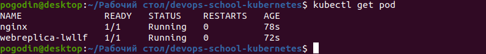

# Task 1.1

### Verify kubectl installation
```
kubectl version --client
```
   Output:
   


### Setup autocomplete for kubectl
```
source <(kubectl completion bash) 
```
   Output:
   


```
minikube start --driver=virtualbox
```
   Output:
   


### Get information about cluster
```
kubectl cluster-info
```
   Output: 
   


### Get information about available nodes
```
kubectl get nodes
```
   Output:
   


## Install Kubernetes Dashboard
```
kubectl apply -f https://raw.githubusercontent.com/kubernetes/dashboard/v2.3.1/aio/deploy/recommended.yaml
```
   Output:
   


### Check kubernetes-dashboard ns
```
kubectl get pod -n kubernetes-dashboard
```
   Output:
   


## Install Metrics Server
```
kubectl apply -f https://github.com/kubernetes-sigs/metrics-server/releases/latest/download/components.yaml
```
### Update deployment
```
kubectl edit -n kube-system deployment metrics-server
```
   Output:
   


## Connect to Dashboard

### Get token
   Manual
```
kubectl describe sa -n kube-system default
# copy token name
kubectl get secrets -n kube-system
kubectl get secrets -n kube-system token_name_from_first_command -o yaml
echo -n "token_from_previous_step" | base64 -d
```

### Connect to Dashboard
```
kubectl proxy
```
   Output:
   


# Task 1.2
## Kubernetes resources introduction
```
kubectl run web --image=nginx:latest
```
   Output:
   


   * take a look at created resource in cmd "kubectl get pods"


   * take a look at created resource in Dashboard


  * take a look at created resource in cmd
```
minikube ssh
docker container ls
```


## Specification
```
kubectl explain pods.spec
```
   Output:
   


   Apply manifests (download from repository)
```
kubectl apply -f pod.yaml
kubectl apply -f rs.yaml
```
   Output:
   


   Look at pod
```
kubectl get pod
```
   Output:
   


## You can create simple manifest from cmd
```
kubectl run web --image=nginx:latest --dry-run=client -o yaml
```
   Output:
   


# Homework
### Create a deployment nginx. Set up two replicas. Remove one of the pods, see what happens.
   Output:
   

