# Task 2

## ConfigMap & Secrets
```
kubectl create secret generic connection-string --from-literal=DATABASE_URL=postgres://connect --dry-run=client -o yaml > secret.yaml
```
   Output:
   
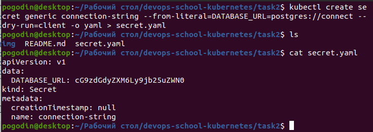
```
kubectl create configmap user --from-literal=firstname=firstname --from-literal=lastname=lastname --dry-run=client -o yaml > cm.yaml
```
   Output:
   
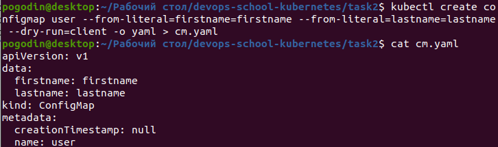

```
kubectl apply -f secret.yaml
kubectl apply -f cm.yaml
kubectl apply -f pod.yaml
```
   Output:
   
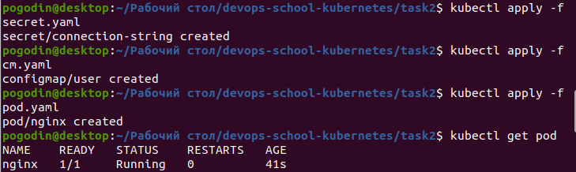

### Check env in pod

```
kubectl exec -it nginx -- bash
printenv
```
   Output:
   
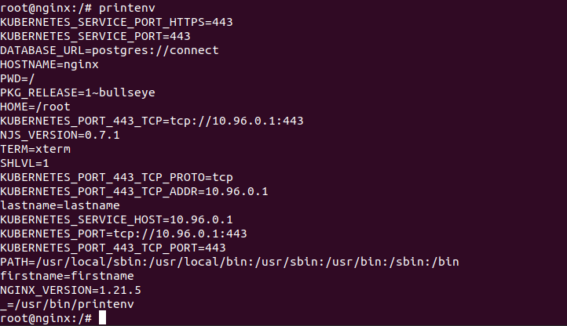

### Create deployment with simple application

```
kubectl apply -f nginx-configmap.yaml
kubectl apply -f deployment.yaml
```

### Get pod ip address

```
kubectl get pods -o wide
```
   Output:
   
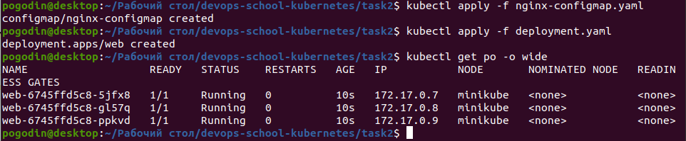

   Try connect to pod with `curl` (`curl pod_ip_address`). What happens?
   * From you PC
   Output:
   


   * From minikube (`minikube ssh`)
   Output:
   


   * From another pod (`kubectl exec -it $(kubectl get pod |awk '{print $1}'|grep web-|head -n1) bash`)
   Output:
   
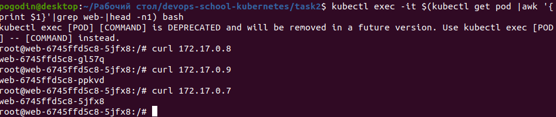

## Create service (ClusterIP)

   The command that can be used to create a manifest template
```
kubectl expose deployment/web --type=ClusterIP --dry-run=client -o yaml > service_template.yaml
```
   Output:
   
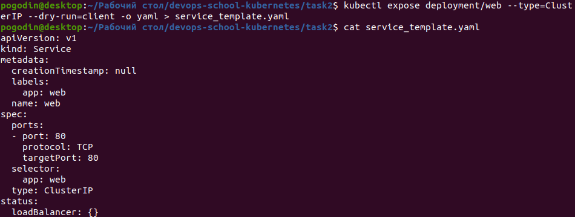

   Apply manifest
```
kubectl apply -f service_template.yaml
```
   Get service CLUSTER-IP
```
kubectl get svc
```
   Output:
   
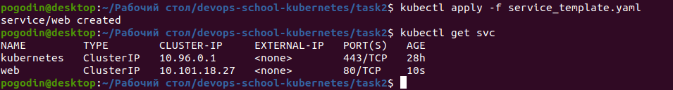

   Try connect to service (`curl service_ip_address`). What happens?

   * From you PC
   Output:
   


   * From minikube (`minikube ssh`) (run the command several times)
   Output:
   
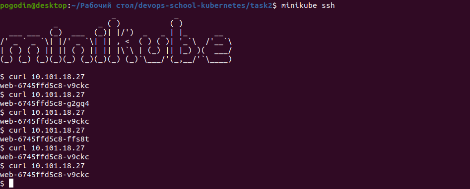

   * From another pod (`kubectl exec -it $(kubectl get pod |awk '{print $1}'|grep web-|head -n1) bash`) (run the command several times)
   Output:
   
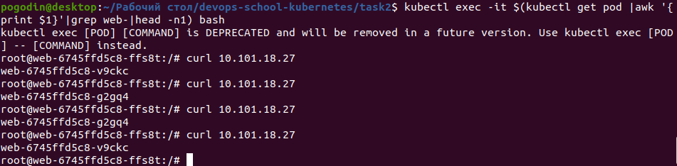

## NodePort
```
kubectl apply -f service-nodeport.yaml
kubectl get service
```
   Output:
   
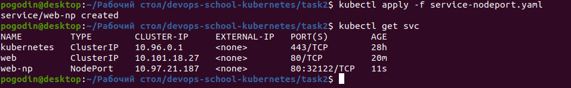

   Note how port is specified for a NodePort service
   
### Checking the availability of the NodePort service type
```
```
   Output:
   


## Headless service
```
kubectl apply -f service-headless.yaml
```
   Output:
   
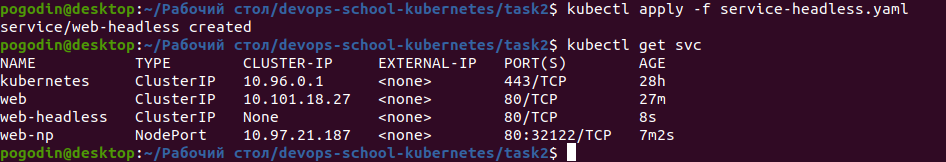

## DNS

   Connect to any pod
```
cat /etc/resolv.conf
```
   Output:
   
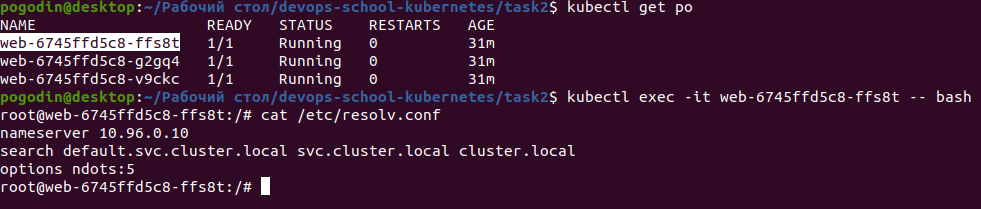

   Compare the IP address of the DNS server in the pod and the DNS service of the Kubernetes cluster.
   
   Output:
   
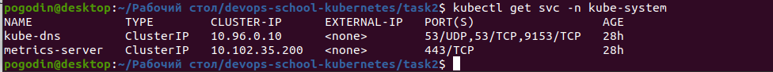

   * Compare headless and clusterip Inside the pod run nslookup to normal clusterip and headless. Compare the results. You will need to create pod with dnsutils.
   Output:
   
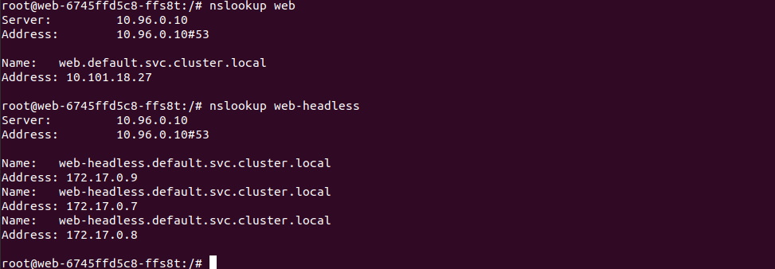

## Ingress

   Enable Ingress controller 
```
minikube addons enable ingress
```
   Output:
   


   Let's see what the ingress controller creates for us
```
kubectl get pods -n ingress-nginx
```
   Output:
   


```
kubectl get pod $(kubectl get pod -n ingress-nginx|grep ingress-nginx-controller|awk '{print $1}') -n ingress-nginx -o yaml
```
   Output:
   
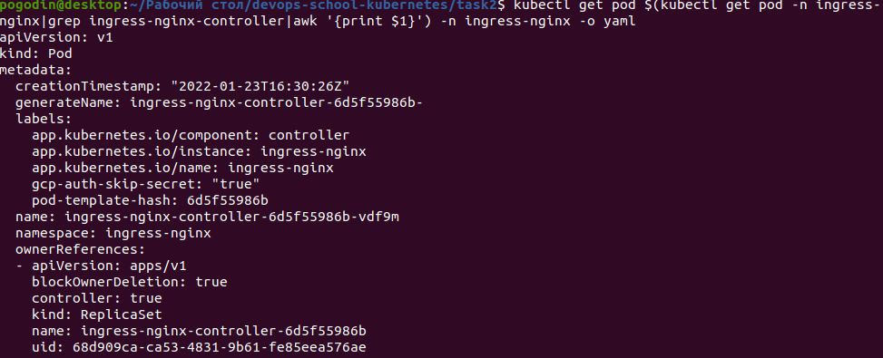

   Create Ingress
```
kubectl apply -f ingress.yaml
curl $(minikube ip)
```
   Output:
   
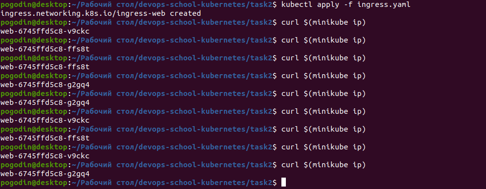

## Homework

   In Minikube in namespace kube-system, there are many different pods running. Your task is to figure out who creates them, and who makes sure they are running (restores them after deletion).
   
   Output:
   


   Implement Canary deployment of an application via Ingress. Traffic to canary deployment should be redirected if you add "canary:always" in the header, otherwise it should go to regular deployment. Set to redirect a percentage of traffic to canary deployment.
   
   Output:
   
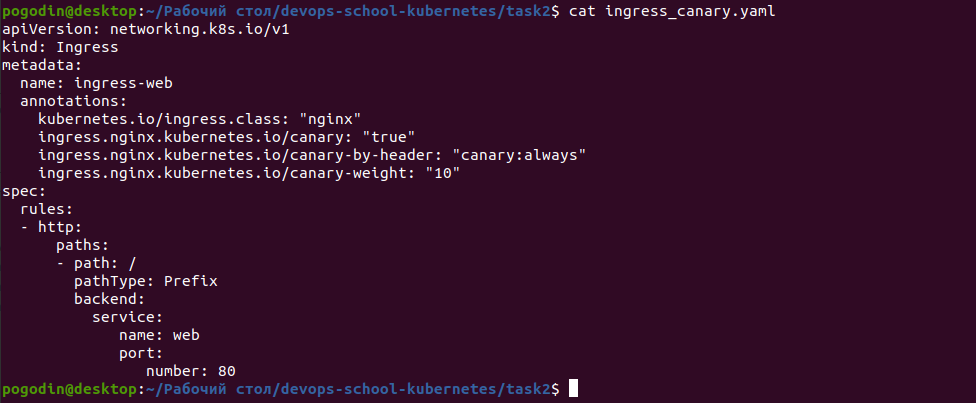


