# Task 3

### Create pv in kubernetes

```
kubectl apply -f pv.yaml
```
   Output:
   


### Check our pv

```
kubectl get pv
```
   Output:
   
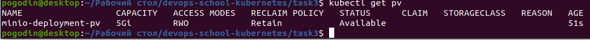

### Create pvc

```
kubectl apply -f pvc.yaml
```
   Output:
   


### Check our output in pv

```
kubectl get pv
```
   Output:
   
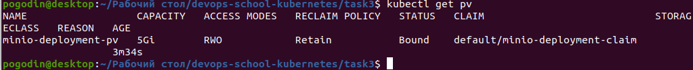

   Output is change. PV get status bound.
   
### Check pvc

   Output:
   


### Apply deployment minio

```
kubectl apply -f deployment.yaml
```
   Output:
   


### Apply svc nodeport

```
kubectl apply -f minio-nodeport.yaml
```
   Output:
   


   Open minikup_ip:node_port in you browser

   Output:
   
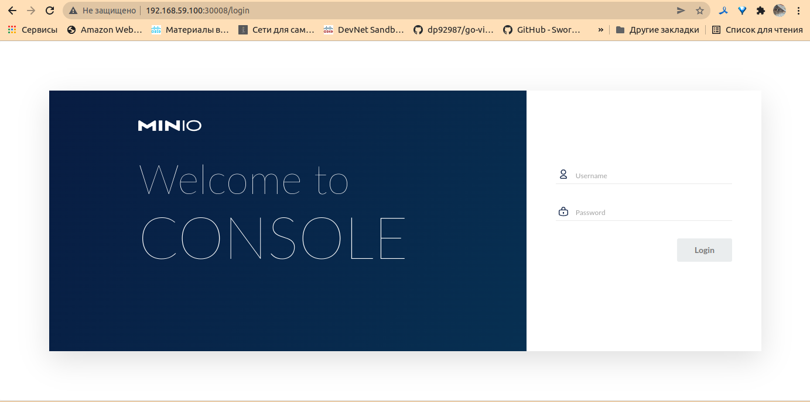

### Apply statefulset

```
kubectl apply -f statefulset.yaml
```
   Output:
   


### Check pod and statefulset

```
kubectl get pod
kubectl get sts
```

   Output:
   


# Homework

   * We published minio "outside" using nodePort. Do the same but using ingress.
   
   Output:
   
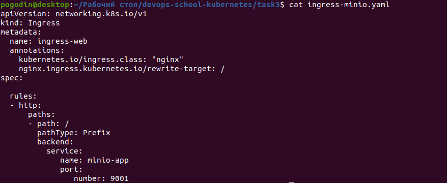

   Output:
   
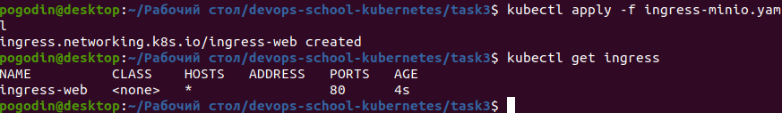


   Output:
   
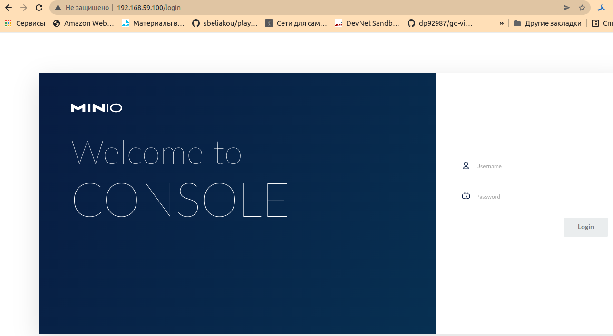
   
   * Publish minio via ingress so that minio by ip_minikube and nginx returning hostname (previous job) by path ip_minikube/web are available at the same time.
   
   Output:
   
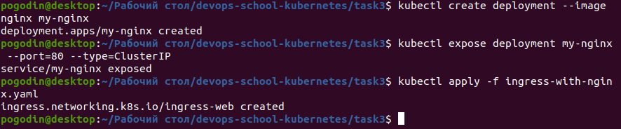

   Output:
   
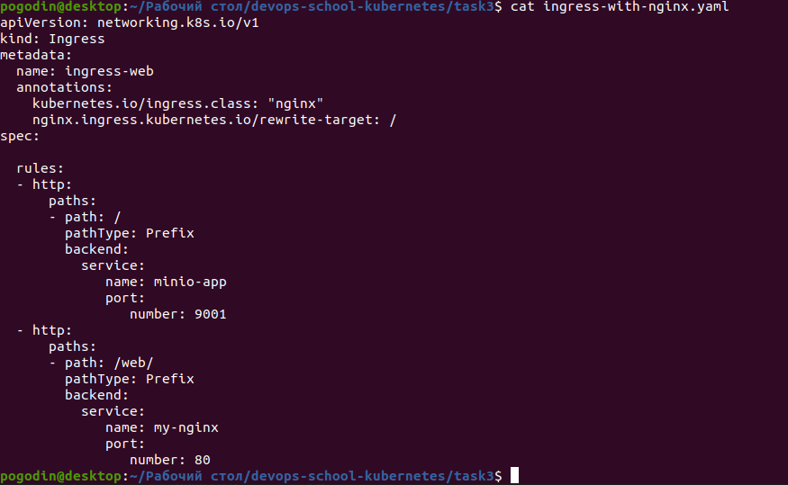

   Output:
   
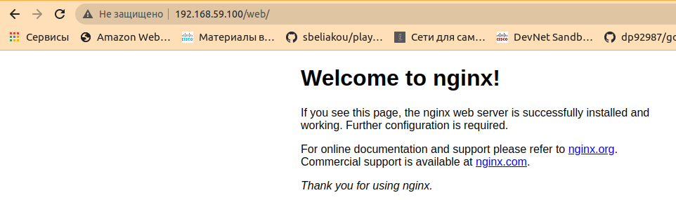
       
   * Create deploy with emptyDir save data to mountPoint emptyDir, delete pods, check data.
   
   Output:
   
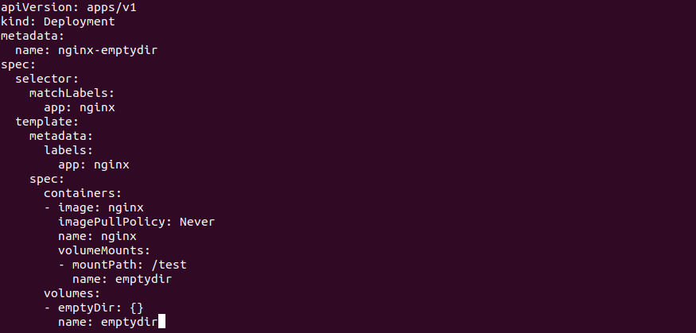

   Output:
   


   Output:
   
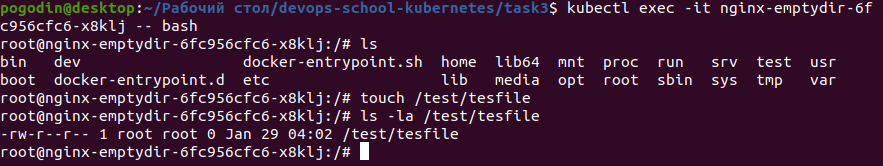

   Output:
   
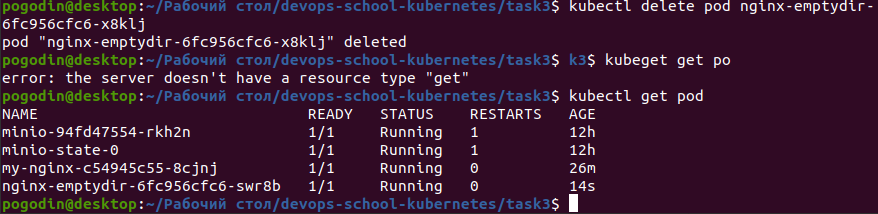

   Output:
   
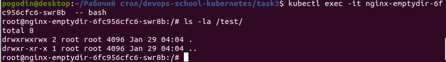
   
   * Optional. Raise an nfs share on a remote machine. Create a pv using this share, create a pvc for it, create a deployment. Save data to the share, delete the deployment, delete the pv/pvc, check that the data is safe.
