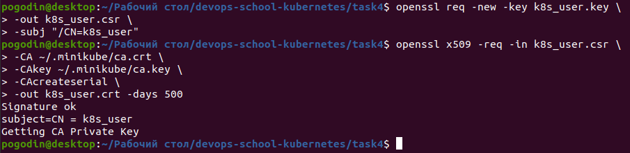
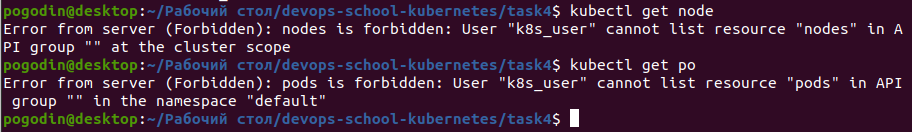
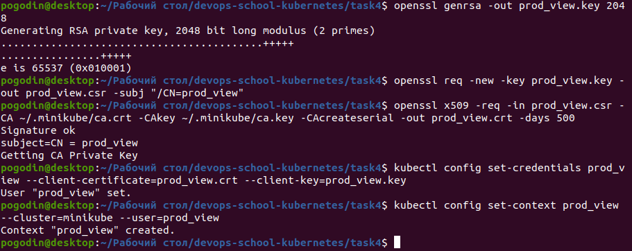
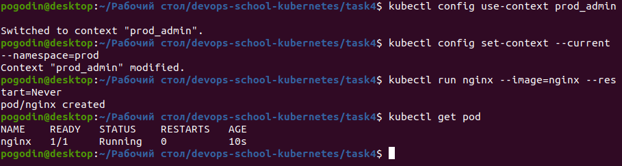

# Task 4

### Check what I can do

```
kubectl auth can-i create deployments --namespace kube-system
```
   Output:
   


## Configure user authentication using x509 certificates

### Create private key

```
openssl genrsa -out k8s_user.key 2048
```
   Output:
   


### Create a certificate signing request

```
openssl req -new -key k8s_user.key \
-out k8s_user.csr \
-subj "/CN=k8s_user"
```

### Sign the CSR in the Kubernetes CA. We have to use the CA certificate and the key, which are usually in /etc/kubernetes/pki. But since we use minikube, the certificates will be on the host machine in ~/.minikube

```
openssl x509 -req -in k8s_user.csr \
-CA ~/.minikube/ca.crt \
-CAkey ~/.minikube/ca.key \
-CAcreateserial \
-out k8s_user.crt -days 500
```
   Output:
   


### Create user in kubernetes

```
kubectl config set-credentials k8s_user \
--client-certificate=k8s_user.crt \
--client-key=k8s_user.key
```
   Output:
   


### Set context for user

```
kubectl config set-context k8s_user \
--cluster=minikube --user=k8s_user
```
   Output:
   


### Edit ~/.kube/config

```
Change path
- name: k8s_user
  user:
    client-certificate: C:\Users\Andrey_Trusikhin\educ\k8s_user.crt
    client-key: C:\Users\Andrey_Trusikhin\educ\k8s_user.key
contexts:
- context:
    cluster: minikube
    user: k8s_user
  name: k8s_user
```

### Switch to use new context

```
kubectl config use-context k8s_user
```
   Output:
   


### Check privileges

```
kubectl get node
kubectl get pod
```
   Output:
   


### Switch to default(admin) context

```
kubectl config use-context minikube
```
   Output:
   


### Bind role and clusterrole to the user

```
kubectl apply -f binding.yaml
```
   Output:
   


### Check output

```
kubectl get pod
```
   Output:
   


   Now we can see pods
   
# Homework

   * Create users `deploy_view` and `deploy_edit`. Give the user `deploy_view` rights only to view deployments, pods. Give the user `deploy_edit` full rights to the objects deployments, pods.

   Create `deploy_view`
   
   Output:
   


   Output:
   


   Create `deploy_edit`
   
   Output:
   


   Output:
   


   Show users

   Output:
   


   Output:
   


   Output:
   


   * Create namespace `prod`. Create users `prod_admin`, `prod_view`. Give the user `prod_admin` admin rights on ns `prod`, give the user `prod_view` only view rights on namespace `prod`.
   
   Create ns

   Output:
   


   Create `prod_admin`

   Output:
   

   
   Create `prod_view`

   Output:
   



   Show users
   
    Output:
   


   Output:
   


   Output:
   


   
   * Create a serviceAccount `sa-namespace-admin`. Grant full rights to namespace default. Create context, authorize using the created sa, check accesses.

   Output:
   


   Output:
   


   
